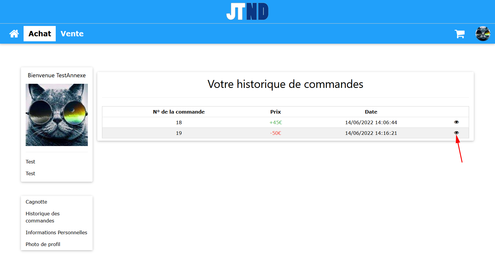
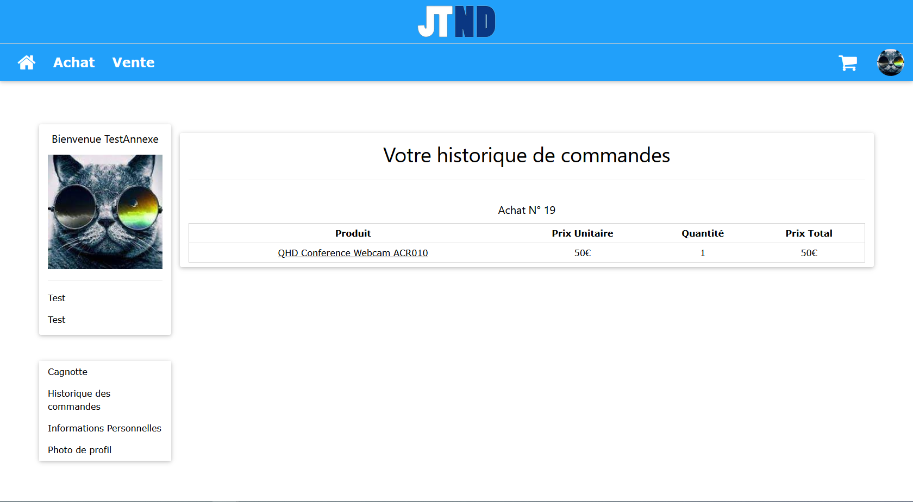

<h1 align="center"> Annexe </h1>

<h2 align="center"> Tests effectués </h2>

## Création d'un compte

1. Cliquer sur l'image de profil -> se connecter  

2. S'inscrire  

 
 

3. On se retrouve sur notre page de profil avec une cagnotte vide et aucun élément extrait  

  

## Changement image de profil

1. Connectez-vous
2. Sur la page de profil ->	Photo de profil 
3. Choisir une image -> Envoyer  

   

4. Votre photo de profil est ensuite modifiée  

  

## Vente d'un produit

1. Connectez-vous
2. Aller sur la page Vente
3. Choisissez un produit  

  

4. Vendez-le  

5. Retourner sur votre page de profil  
6. Votre cagnotte ainsi que vos éléments extraits ont été mis à jour  

  

7. Dans votre historique de commandes vous apercevez la commande  

## Achat d'un produit (cagnotte insuffisante)

1. Connectez-vous
2. Aller sur la page Achat
3. Choisissez un produit ayant un prix supérieur au solde de votre cagnotte  

4. Ajoutez-le au panier  

  

5. Cliquer sur l'icone de panier -> Payer  

  

6. Le paiement est refusé  

  

7. Votre cagnotte n'a pas été mis à jour

## Achat d'un produit

1. Connectez-vous
2. Aller sur la page Achat
3. Choisissez un produit
4. Ajoutez-le au panier
5. Cliquer sur l'icone de panier -> Payer (pour cet exemple la cagnotte a été augmentée artificiellement)  

  

6. Retourner sur votre page de profil
7. Votre cagnotte a été mis à jour
8. Dans votre historique de commandes vous apercevez la commande  

## Modification du mot de passe

1. Connectez-vous
2. Sur la page de profil ->	Informations Personnelles
3. Changer votre mot de passe

  

4. Entrez les informations nécessaires  

  

5. Votre mot de passe est modifié  

